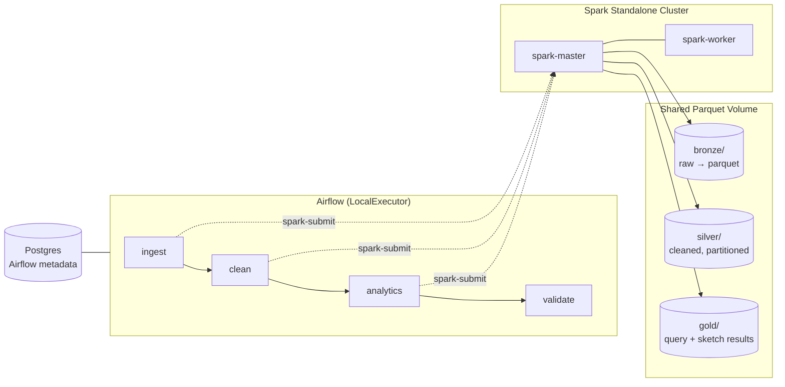

# NYC Taxi Analytics — Pipeline Design Document

| | |
|---|---|
| **Project** | NYC-Taxi-Analytics-Spark (v2 — Dockerized + Orchestrated) |
| **Course** | ML Systems |
| **Document status** | Draft for implementation |
| **Supersedes** | v1.0 local Scala/HDFS implementation |
| **Target release tag** | `v2.0-docker-airflow` |

---

## 1. Purpose & context

This is the **v2 redesign** of an existing project. v1 was a single Scala/Spark application (`App.scala`) that ran locally against HDFS and compared **exact** analytical query results against two approximate summarization techniques — **Reservoir Sampling (Algorithm R)** and **Count-Min Sketch (CMS)** — over NYC Yellow Taxi data.

v2 does **not** rewrite that analytical logic. It keeps the sketching/sampling substance intact and adds the two systems-level layers the course asks us to explore: **Apache Airflow** for orchestration and **Docker** for containerization. The project goal is to use both tools deeply, evaluate their capabilities and trade-offs, and produce a report plus a short presentation.

The narrative we are deliberately telling: *we took a working monolithic Spark job and evolved it into a containerized, orchestrated, medallion-architecture data pipeline.* The evolution itself is the contribution, which is why versioning and the v1→v2 migration are first-class concerns (Section 10).

### Three migrations from v1 → v2

1. **Local → Docker.** Every component runs in containers; nothing is installed on the host except Docker.
2. **HDFS → partitioned Parquet on a shared volume.** HDFS is removed entirely.
3. **Monolith → orchestrated stages.** One job becomes discrete, independently re-runnable Airflow tasks.

---

## 2. Scope & objectives

**In scope (core deliverable):**
- A containerized Spark standalone cluster (1 master + 1 worker) running our analytics.
- An Airflow DAG orchestrating a medallion pipeline: `ingest → clean → analytics → validate`.
- Preservation of the v1 exact-vs-approximate comparison (Reservoir Sampling + CMS).
- A data-quality gate between data preparation and analytics.
- A written report and a ~8–10 slide presentation evaluating both tools.

**Stretch (only if Day-2 time allows):**
- A Spark MLlib stage (e.g. tip-amount regression) producing a model artifact + `metrics.json`.

**Explicitly out of scope** — see Section 9 for the full list and rationale.

---

## 3. Tech stack

| Layer | Technology | Pinned version | Role / notes |
|---|---|---|---|
| Compute | Apache Spark | `apache/spark:3.5.6` | Official ASF image. **NOT Bitnami** (see note below). |
| Language | Scala | 2.12 *(confirm against `build.sbt`)* | The official `apache/spark:3.5.x` image is a Scala 2.12 build. If your project targets 2.13, see §3.1. |
| Build | sbt (sbt-assembly) | latest | Produces a single fat JAR with multiple `main` classes. |
| Orchestration | Apache Airflow | `apache/airflow:3.2.2` | Official image. Run with **LocalExecutor**, not Celery. |
| Metadata DB | PostgreSQL | `postgres:16` | Airflow metadata store only. |
| Storage | Parquet on Docker volume | — | Replaces HDFS. Medallion layers: bronze / silver / gold. |
| Runtime | OpenJDK | 17 (bundled in Spark image) | Spark 3.5 runs on Java 17. |
| Container runtime | Docker + Docker Compose v2 | host-installed | WSL2 backend on Windows 11. |
| Diagrams / docs | Markdown + Mermaid | — | This doc + architecture diagrams render on GitHub. |

> **Image-source rule.** Use **official** `apache/spark` and `apache/airflow` images only. Do **not** use `bitnami/spark` or other `bitnami/*` images — Bitnami removed its free versioned images from Docker Hub in late 2025 (moved to a `bitnamilegacy` repo, public catalog removed Sept 2025), so Bitnami-based compose files now fail to pull. Many older tutorials still use them; ignore those.

### 3.1 Scala version decision (must confirm before building)

The fat JAR's Scala binary version **must** match the Spark distribution inside the container.
- **If `build.sbt` targets Scala 2.12** → `apache/spark:3.5.x` works directly (recommended path).
- **If it targets Scala 2.13** → either move to a Scala 2.13 Spark distribution (Spark 4.x is 2.13-only) or build a custom 2.13 Spark image. More work; avoid under deadline.

**Action:** open `build.sbt`, read `scalaVersion`, and pin Spark accordingly before writing the Dockerfile.

---

## 4. Architecture

A medallion (bronze → silver → gold) data lake. Airflow decides **when and what** runs; Spark decides **how it is computed**. This separation is the single most important principle to highlight in the report.



### 4.1 Pipeline stages

Each stage is a separate `main` class inside one fat JAR, submitted as a separate Airflow task.

| Stage | Reads | Writes | Responsibility |
|---|---|---|---|
| **ingest** | raw CSV (mounted) | `bronze/` parquet | Land raw data as parquet. No business logic. |
| **clean** | `bronze/` | `silver/` (partitioned by year/month) | The v1 `taxiDF` prep: cast timestamps, filter passenger/location/date, dedup, and bake in *stable* enrichments (`payment_type_desc`). Also materialize the **reservoir sample** here for reproducibility. |
| **analytics** | `silver/` | `gold/` | The 6 queries + exact-vs-sample-vs-CMS comparison. Query-specific derivations (`hour`, `day_of_week`) live here. All 6 queries share one loaded/cached DataFrame. |
| **validate** | `silver/` (+ `gold/`) | quality report / task status | Row counts, null checks, range assertions. Gates the pipeline; fails the DAG run on violation. |
| **train** *(stretch)* | `silver/` | `gold/model/`, `metrics.json` | Optional Spark MLlib regression. |

### 4.2 Why clean and analytics are separate (and queries are not)

**Separate at the layer boundary.** Materializing cleaned data to `silver/` makes it a single source of truth that every query, the sample, the CMS, and any future ML stage consume. Benefits: targeted re-runs (tweak a query → re-run only `analytics`), a real surface for the quality gate to assert against, and partition pruning for time-filtered queries (Query 2 especially).

**Do not separate below that boundary.** The six queries share one cached DataFrame; splitting them into six tasks would kill the caching benefit and clutter the DAG. The correct granularity is `ingest / clean / analytics / validate`. Stopping at the layer boundary — and documenting *why* — is itself the maturity signal.

### 4.3 Airflow → Spark submission

**Primary:** `SparkSubmitOperator` (from `apache-airflow-providers-apache-spark`) against a Spark connection pointing at `spark://spark-master:7077`. This requires a Spark client + Java on the Airflow image (extend the base image).

**Fallback (time-boxed):** if the connection setup exceeds ~30 minutes, use a `DockerOperator` or a `BashOperator` running `docker exec spark-master spark-submit …` (mount the Docker socket into Airflow). Reliable, slightly less idiomatic — document it as a pragmatic choice.

---

## 5. Infrastructure setup

### 5.1 Compose services

| Service | Image | Ports (host) | Purpose |
|---|---|---|---|
| `spark-master` | `apache/spark:3.5.6` | 8080 (UI), 7077 | Cluster master + Spark UI (screenshot source). |
| `spark-worker` | `apache/spark:3.5.6` | 8081 (UI) | Single worker, capped resources. |
| `airflow-scheduler` | extended `apache/airflow:3.2.2` | — | Runs the DAG. |
| `airflow-apiserver` | extended `apache/airflow:3.2.2` | 8081→8082 (UI) | Airflow web UI. *(Map carefully to avoid clashing with the Spark worker UI.)* |
| `postgres` | `postgres:16` | — | Airflow metadata only. |

> Drop Redis, the Celery worker, and Flower from the official compose file — they are unnecessary under LocalExecutor and waste RAM.

### 5.2 Resource allocation (16 GB host)

This is the main risk. Everything is resident simultaneously.

| Setting | Value | Where |
|---|---|---|
| WSL2 memory | 10–12 GB | `.wslconfig` (leave Windows headroom) |
| Spark worker memory | 3–4 GB | `SPARK_WORKER_MEMORY` |
| Spark driver memory | 1–2 GB | `--driver-memory` |
| Spark executor memory | ~2–3 GB | `--executor-memory` |
| Dev dataset size | **1–2 months sampled** | not the full 9 GB |
| Full 2021–2023 run | optional, documented **scale test** only | — |

Run the pipeline on a sample during development. Reserve the full dataset for one optional, documented scale test (which is itself good report material).

### 5.3 Networking & volumes

- One Docker network; services reach each other by name (`spark-master`, `postgres`).
- A named volume (or bind mount) holds `bronze/ silver/ gold/`, mounted into **both** Spark containers at the same path so master and worker see identical data.
- The fat JAR is mounted (or baked) into the Spark containers; Airflow references it by container path in the submit command.
- Airflow `dags/`, `logs/`, `plugins/`, `config/` are bind-mounted from the repo.

---

## 6. Project / repository structure

```text
NYC-Taxi-Analytics-Spark/
├── README.md                     # run instructions, quickstart
├── DESIGN.md                     # this document
├── CHANGELOG.md                  # v1 → v2 migration notes
├── Makefile                      # make up / down / build / run / clean
├── .env.example                  # documented config template (committed)
├── .env                          # real config (gitignored)
├── .gitignore
│
├── docker/
│   ├── docker-compose.yml        # spark master+worker, airflow, postgres
│   ├── airflow.Dockerfile        # apache/airflow + spark client + provider
│   └── spark.Dockerfile          # optional: bakes the JAR into apache/spark
│
├── spark-app/                    # the Scala project (evolved from v1)
│   ├── build.sbt                 # sbt-assembly; CONFIRM scalaVersion here
│   ├── project/
│   └── src/main/scala/
│       ├── IngestJob.scala       # bronze
│       ├── CleanJob.scala        # silver (taxiDF prep + reservoir sample)
│       ├── AnalyticsJob.scala    # gold (6 queries + sampling + CMS)
│       ├── ValidateJob.scala     # quality gate  (or Python — see §7)
│       ├── TrainJob.scala        # OPTIONAL MLlib stretch
│       └── common/               # shared schema, paths, config
│
├── airflow/
│   ├── dags/
│   │   └── taxi_pipeline_dag.py  # ingest → clean → analytics → validate
│   └── config/
│
├── data/                         # gitignored; mounted into Spark
│   ├── bronze/
│   ├── silver/
│   └── gold/
│
└── docs/
    ├── architecture.md / .mmd    # diagram source for report + deck
    └── screenshots/              # Spark UI + Airflow graph (for deliverables)
```

> The v1 `App.scala` is decomposed into `IngestJob` / `CleanJob` / `AnalyticsJob`; the analytical logic is copied across largely unchanged, with `println`-only output replaced by `.write.parquet(...)`.

---

## 7. Engineering rules (DO)

These are the practices we **will** apply — chosen to demonstrate industry quality without over-engineering.

1. **Idempotent, re-runnable stages.** Use overwrite-by-partition so re-running a stage is safe and produces the same result. No appends that double-count.
2. **One source of truth per layer.** Cleaning logic exists in exactly one place (`CleanJob`); everything downstream reads `silver/`.
3. **Partitioned Parquet.** Write `silver/` partitioned by year/month to enable partition pruning. Columnar + compressed.
4. **Reproducible approximation.** Materialize the reservoir sample as a `silver/` artifact with a fixed seed so exact-vs-approximate comparisons are stable across re-runs — central to the project's whole point.
5. **Config separated from code.** Paths, dataset window, CMS `eps`/`confidence`, sample size → `.env` / DAG params. Never hardcode, never commit secrets. Ship `.env.example`.
6. **A real quality gate.** `validate` asserts row counts and null/range checks on key columns and **fails the run** on violation, before bad data reaches analysis. Lightweight assertions are enough — this can be a small Spark job or a Python task in the DAG.
7. **Retries + logging.** DAG tasks have sensible retry counts and emit logs; the DAG is parameterized and scheduled (with a note on backfill).
8. **Pinned versions everywhere.** All images and the Spark/Scala versions are pinned; no `:latest`.
9. **Reproducible environment.** `docker compose up` from a clean checkout produces a working system. A `Makefile` wraps the common commands.
10. **Evidence captured.** Spark UI (stage DAG, shuffles) and Airflow graph-view screenshots saved to `docs/` for the report and deck.
11. **Tool-exploration breadth (for the evaluation).** Deliberately exercise a range of features so there is material to assess: Spark DataFrame API + Spark SQL, `.explain()` on a query plan (Catalyst), caching, a broadcast join (already in v1 for the payment map); Airflow TaskFlow API, XComs, retries, a sensor or branch, and a backfill demonstration. Each maps to a pros/cons bullet.

---

## 8. Implementation rules (DO NOT)

1. **Do not split the 6 queries into separate Airflow tasks.** They share a cached DataFrame; per-query tasks destroy that and bloat the DAG. (§4.2)
2. **Do not reintroduce HDFS.** Parquet on a shared volume is the storage layer. (§1)
3. **Do not use Bitnami images.** Official `apache/*` only. (§3)
4. **Do not use CeleryExecutor / Redis / Flower.** LocalExecutor only, for memory. (§5.1)
5. **Do not run the full 9 GB dataset during iteration.** Sample for dev; full run is an optional scale test. (§5.2)
6. **Do not rewrite the analytics in PySpark.** The CMS `mapPartitions` logic is Scala-idiomatic and already works; porting wastes time and discards v1 work.
7. **Do not let Spark auto-grab all memory.** Cap driver/executor/worker explicitly. (§5.2)
8. **Do not hardcode config or commit `.env`.** (§7.5)
9. **Do not over-build the quality layer.** A handful of assertions, not a full Great Expectations suite at this scale.
10. **Do not chase the MLlib stage until core is green and tagged.** It is stretch-only.

---

## 9. Out of scope (deliberate, with rationale)

Each of these belongs in the report's *"what we would add for production"* section. Listing them as conscious decisions is the anti-over-engineering signal.

| Excluded | Why |
|---|---|
| Kubernetes | Standalone Spark + Compose is sufficient at this scale; K8s is operational overhead with no learning payoff here. |
| Celery / multi-node executors | LocalExecutor handles our DAG; Celery adds 3+ containers of RAM cost. |
| Kafka / Structured Streaming | This is a batch pipeline. Streaming is evaluated in the report, not built. |
| HDFS / distributed FS | Removed in favor of Parquet on a volume. |
| Full CI/CD, Terraform/IaC | Out of scope for a 2-day course project; mention as production considerations. |
| Feature store | No multi-consumer feature reuse need. |
| Full Great Expectations suite | Lightweight assertions suffice at this data scale. |
| GPU / RAPIDS Accelerator for Spark | Spark MLlib does not use the GPU; RAPIDS integration cost is unjustified at our scale. A genuine pro/con to discuss, not a gap. |

---

## 10. Version control & release strategy

The v1→v2 evolution must be *visible* in git history — this is what demonstrates we are maturing an existing system.

```bash
# 1. Snapshot v1 BEFORE any changes
git tag -a v1.0-local -m "Local Scala/HDFS version (pre-Docker)"
git push --tags

# 2. Work on a branch
git checkout -b feat/dockerize-airflow
#    ... implement v2 ...
git checkout main && git merge feat/dockerize-airflow

# 3. Tag the result and write release notes
git tag -a v2.0-docker-airflow -m "Dockerized + Airflow-orchestrated medallion pipeline"
git push --tags
```

`CHANGELOG.md` documents the three migrations (HDFS→Parquet, local→Docker, monolith→orchestrated stages). On GitHub, promote the `v2.0` tag to a Release using those notes. The before/after tags plus a migration-focused changelog are worth more than the diff alone.

---

## 11. Risks & mitigations

| Risk | Likelihood | Mitigation |
|---|---|---|
| Memory exhaustion on 16 GB | High | LocalExecutor, capped Spark memory, sampled dataset. (§5.2) |
| `SparkSubmitOperator` connection setup eats time | Medium | Time-box to 30 min; fall back to `DockerOperator`/`docker exec`. (§4.3) |
| Scala/Spark version mismatch | Medium | Confirm `scalaVersion` first; pin Spark to match. (§3.1) |
| Docker infra is the riskiest step | High | Front-load it on Day 1; get a hand-run `spark-submit` green before touching the DAG. |
| Port clash (Spark worker UI vs Airflow UI both 8081) | Low | Map host ports explicitly in compose. (§5.1) |
| Scope creep into MLlib/streaming | Medium | Stretch items gated behind a green, tagged core. (§8.10) |

---

## 12. Deliverables checklist

- [ ] `docker compose up` brings up Spark + Airflow + Postgres cleanly.
- [ ] Airflow DAG runs `ingest → clean → analytics → validate` green end-to-end.
- [ ] `silver/` materialized + partitioned; reservoir sample materialized with fixed seed.
- [ ] `gold/` contains the 6 query outputs with exact / sample / CMS comparison.
- [ ] Quality gate fails the run on injected bad data (demonstrated).
- [ ] Spark UI + Airflow graph screenshots captured.
- [ ] `v1.0-local` and `v2.0-docker-airflow` tags + `CHANGELOG.md` pushed.
- [ ] Report (problem → architecture → Spark deep-dive → Airflow deep-dive → evaluation → limitations).
- [ ] Presentation (~8–10 slides).
- [ ] *(Optional)* MLlib stage with `metrics.json`.

---

## 13. Open decisions to confirm

1. **Scala version** — read `build.sbt`; pins the Spark image. (§3.1)
2. **MLlib stretch** — include `TrainJob` or keep the project pure sketching/sampling?
3. **Submit mechanism** — attempt `SparkSubmitOperator` first, or go straight to the `docker exec` fallback for reliability?
4. **Validate stage language** — Scala job in the JAR, or a lightweight Python task in the DAG?